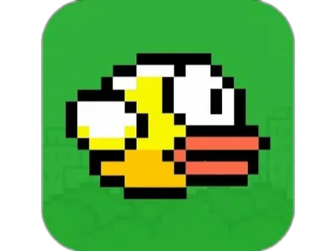

# Игра Flappy Bird

Этот репозиторий содержит реализацию классической аркадной игры "Flappy Bird" на языке программирования C# с использованием интегрированной среды разработки Unity.

## Описание

"Flappy Bird" — это аркадная игра, вдохновленная классическими играми из 8-битной эры. Игрок управляет птицей, которую нужно провести сквозь серию препятствий, представленных в виде труб. Цель игры — продержаться как можно дольше, избегая столкновений с препятствиями. Управление осуществляется поднятием птицы вверх для избежания столкновения с трубами.

## Управление

- **Пробел / Нажатие на экран:** Поднять птицу вверх, чтобы избежать столкновения с трубами.
- **Alt + F4:** Закрыть игру.

## Установка и запуск

### Windows

1. Скачайте файл `FlappyBird.exe` из раздела релизов на этой странице.
2. Запустите `FlappyBird.exe` и наслаждайтесь игрой.

### IOS/Android

1. Скачайте файл `FlappyBird.apk` из раздела релизов на этой странице.
2. Установите `FlappyBird.apk` на своем устройстве Android.
3. Запустите игру и наслаждайтесь!
